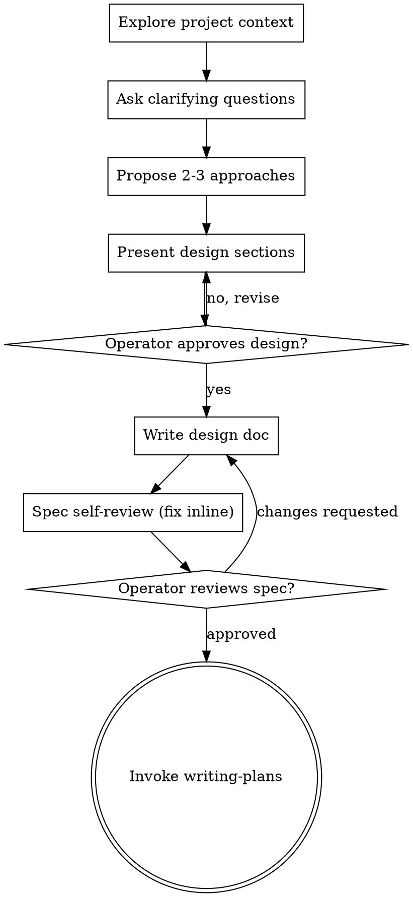

# Brainstorming Ideas Into Designs

Turn ideas into fully formed designs and specs through collaborative dialogue. Understand project context first, then ask refining questions one at a time, then present a design and get explicit approval before any implementation begins.

> **NovaCore adaptations (vendored from Superpowers v5.0.7):**
> - The upstream **Visual Companion** (browser-served HTML mockups) is **out of scope** for this vendoring. Text-only brainstorming only.
> - Spec output currently lands in `docs/superpowers/specs/YYYY-MM-DD-<topic>-design.md`. Retargeting spec output through `plan-tracker` into the Obsidian vault is **deferred** (tracked in `.claude/skills/_vendored/SUPERPOWERS.md`). `writing-plans` *is* already retargeted to the vault.
> - Upstream's "MUST" language is kept where it protects the HARD-GATE; elsewhere this skill is recommended, not mandatory, consistent with NovaCore's path-choice autonomy policy.

<HARD-GATE>
Do NOT invoke any implementation skill, write any code, scaffold any project, or take any implementation action until you have presented a design and the operator has approved it. This applies to every project regardless of perceived simplicity.
</HARD-GATE>

## Anti-Pattern: "This Is Too Simple To Need A Design"

Every project goes through this process. A todo list, a one-function utility, a config change — all of them. "Simple" projects are where unexamined assumptions cause the most wasted work. The design can be short (a few sentences for truly simple projects), but you must present it and get approval.

## Checklist

Create a task for each of these and complete them in order:

1. **Explore project context** — check files, docs, recent commits
2. **Ask clarifying questions** — one at a time; understand purpose, constraints, success criteria
3. **Propose 2–3 approaches** — with trade-offs and your recommendation
4. **Present design** — in sections scaled to their complexity; get operator approval per section
5. **Write design doc** — save to `docs/superpowers/specs/YYYY-MM-DD-<topic>-design.md` and commit
6. **Spec self-review** — inline check for placeholders, contradictions, ambiguity, scope
7. **Operator reviews written spec** — ask for review before proceeding
8. **Transition to implementation** — invoke `writing-plans` to create the implementation plan

## Process Flow

**Terminal state is invoking `writing-plans`.** Do not jump to any other implementation skill from here.

## The Process

**Understanding the idea:**

- Check the current project state first (files, docs, recent commits)
- Before asking detailed questions, assess scope. If the request describes multiple independent subsystems (e.g., "build a platform with chat, file storage, billing, and analytics"), flag that immediately — don't refine a project that needs decomposition first.
- If the project is too large for a single spec, help decompose into sub-projects: what are the independent pieces, how do they relate, what order? Then brainstorm the first sub-project through this flow. Each sub-project gets its own spec → plan → implementation cycle.
- For appropriately-scoped projects, ask one question at a time. Multiple-choice when possible; open-ended is fine otherwise. One question per message.
- Focus on: purpose, constraints, success criteria.

**Exploring approaches:**

- Propose 2–3 different approaches with trade-offs.
- Lead with your recommended option and explain why.

**Presenting the design:**

- Once you believe you understand what you're building, present the design.
- Scale each section to complexity: a few sentences when straightforward, up to 200–300 words when nuanced.
- Ask after each section whether it looks right so far.
- Cover: architecture, components, data flow, error handling, testing.
- Go back and clarify if something doesn't make sense.

**Design for isolation and clarity:**

- Break the system into units with one clear purpose, well-defined interfaces, and independent testability.
- For each unit: what does it do, how do you use it, what does it depend on?
- Large files are a signal that a unit is doing too much.

**Working in existing codebases:**

- Explore the current structure before proposing changes. Follow existing patterns.
- If existing code has problems that affect the work (oversized file, unclear boundaries), include targeted improvements in the design.
- Don't propose unrelated refactoring. Stay focused on the current goal.

## After the Design

**Documentation:**

- Write the validated design to `docs/superpowers/specs/YYYY-MM-DD-<topic>-design.md` (operator preference overrides this default; Phase 2 wiring retargets to vault via `plan-tracker`).
- Commit the design document to git.

**Spec Self-Review:**

After writing the spec, look at it with fresh eyes:

1. **Placeholder scan:** any "TBD", "TODO", incomplete sections, or vague requirements? Fix them.
2. **Internal consistency:** any sections contradict each other? Does the architecture match the feature descriptions?
3. **Scope check:** focused enough for one implementation plan, or does it need decomposition?
4. **Ambiguity check:** any requirement interpretable two different ways? Pick one and make it explicit.

Fix issues inline. No need to re-review — just fix and move on.

**Operator Review Gate:**

After the self-review passes, ask the operator to review the spec before proceeding:

> "Spec written and committed to `<path>`. Please review and let me know if you want changes before we write the implementation plan."

Wait for a response. If changes requested, make them and re-run self-review. Only proceed once approved.

**Implementation handoff:**

- Invoke the `writing-plans` skill to create a detailed implementation plan.
- Do not invoke any other skill from here. `writing-plans` is the next step.

## Key Principles

- One question at a time
- Multiple choice preferred when appropriate
- YAGNI ruthlessly — remove unnecessary features
- Explore alternatives — always propose 2–3 approaches before settling
- Incremental validation — present the design, get approval before moving on
- Be flexible — go back and clarify when something doesn't fit
