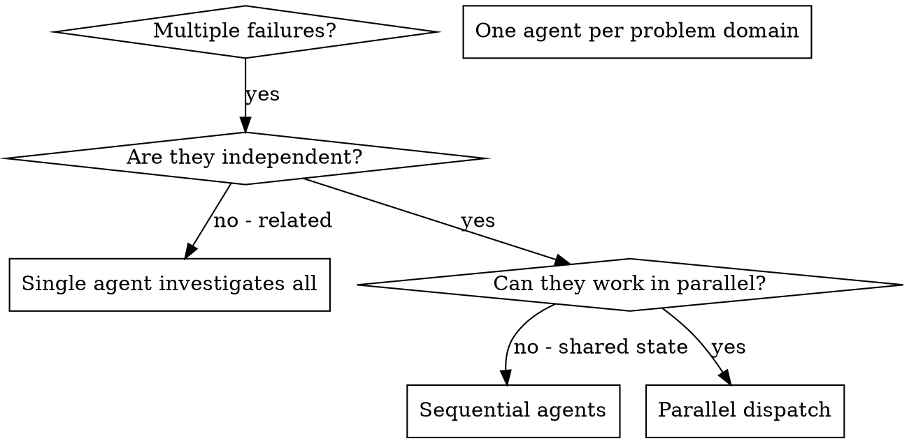

# Dispatching Parallel Agents

## Overview

Delegate tasks to specialized agents with isolated context. By precisely crafting their instructions, you keep them focused and successful at their task. They should never inherit your session's context or history — you construct exactly what they need. This also preserves your own context for coordination work.

When you have multiple unrelated failures (different test files, different subsystems, different bugs), investigating them sequentially wastes time. Each investigation is independent and can happen in parallel.

**Core principle:** one agent per independent problem domain. Let them work concurrently.

> **NovaCore adaptations (vendored from Superpowers v5.0.7):**
> - **Cost-optimized subagent model selection** (adopted from Superpowers v5): for well-specified, bounded implementation subtasks, prefer the cheapest model capable of the task — typically **Haiku 4.5** for single-file edits with clear specs, escalating to Sonnet/Opus only when the subtask requires deeper reasoning or cross-file architectural judgment. The orchestrator chooses; the operator can override.
> - Parallel dispatch must respect the budget rules referenced in `AGENTS/orchestrator/AGENT.md`. Making this a **programmatic hard gate** (budget-check hook) is **deferred** (tracked in `.claude/skills/_vendored/SUPERPOWERS.md`); for now it is a documented expectation the orchestrator is responsible for honoring.
> - For disciplined multi-agent *implementation workflows* (validate → implement → review → verify), use `implementation-team`. This skill covers the narrower case of ad-hoc parallel dispatch for independent problems.

## When to Use



**Use when:**
- 3+ test files failing with different root causes
- Multiple subsystems broken independently
- Each problem can be understood without context from others
- No shared state between investigations

**Don't use when:**
- Failures are related (fix one might fix others)
- Need to understand full system state
- Agents would interfere with each other (editing same files, sharing resources)

## The Pattern

### 1. Identify Independent Domains

Group failures by what's broken:
- File A tests: tool approval flow
- File B tests: batch completion behavior
- File C tests: abort functionality

Each domain is independent — fixing tool approval doesn't affect abort tests.

### 2. Create Focused Agent Tasks

Each agent gets:
- **Specific scope:** one test file or subsystem
- **Clear goal:** make these tests pass
- **Constraints:** don't change other code
- **Expected output:** summary of what you found and fixed
- **Model selection:** use the cheapest capable model (see cost-optimized selection below)

### 3. Dispatch in Parallel

```
Task("Fix tests/agent_tool_abort.py failures", model="haiku")
Task("Fix tests/batch_completion_behavior.py failures", model="haiku")
Task("Fix tests/tool_approval_race_conditions.py failures", model="sonnet")
# All three run concurrently
```

### 4. Review and Integrate

When agents return:
- Read each summary
- Verify fixes don't conflict
- Run the full test suite
- Integrate all changes

## Cost-Optimized Model Selection

For well-planned, narrowly-scoped subtasks, pick the cheapest capable model. Rough heuristics:

| Subtask profile | Model |
|---|---|
| Single-file edit, clear spec, mechanical transformation | Haiku 4.5 |
| Multi-file edit, bounded behavioral change, has failing test | Haiku 4.5 or Sonnet 4.6 |
| Cross-file refactor with architectural judgment | Sonnet 4.6 |
| Novel design decisions, trade-off analysis, debugging with unknowns | Opus 4.7 |

If the subagent's output is insufficient, escalate to a larger model rather than sending the original task to Opus speculatively. The orchestrator owns model selection; the operator can override.

## Agent Prompt Structure

Good agent prompts are:
1. **Focused** — one clear problem domain
2. **Self-contained** — all context needed to understand the problem
3. **Specific about output** — what should the agent return?

```markdown
Fix the 3 failing tests in tests/agent_tool_abort.py:

1. "should abort tool with partial output capture" — expects 'interrupted at' in message
2. "should handle mixed completed and aborted tools" — fast tool aborted instead of completed
3. "should properly track pending_tool_count" — expects 3 results but gets 0

These are timing/race-condition issues. Your task:

1. Read the test file and understand what each test verifies.
2. Identify root cause — timing issues or actual bugs?
3. Fix by:
   - Replacing arbitrary timeouts with event-based waiting
   - Fixing bugs in abort implementation if found
   - Adjusting test expectations if testing changed behavior

Do NOT just increase timeouts — find the real issue.

Return: summary of what you found and what you fixed.
```

## Common Mistakes

- **Too broad:** "Fix all the tests" — agent gets lost. **Fix:** specific scope.
- **No context:** "Fix the race condition" — agent doesn't know where. **Fix:** paste errors and test names.
- **No constraints:** agent might refactor everything. **Fix:** "Do NOT change production code" / "Fix tests only".
- **Vague output:** "Fix it" — you don't know what changed. **Fix:** "Return summary of root cause and changes".
- **Wrong model:** Opus for a single-file mechanical edit wastes tokens. **Fix:** match model to task profile.

## When NOT to Use

- **Related failures:** fixing one might fix others — investigate together first.
- **Need full context:** understanding requires seeing the whole system.
- **Exploratory debugging:** you don't know what's broken yet.
- **Shared state:** agents would interfere (editing same files, using same resources).

## Verification

After agents return:
1. Review each summary — understand what changed.
2. Check for conflicts — did agents edit the same code?
3. Run the full suite — verify all fixes work together.
4. Spot-check — agents can make systematic errors.

## Key Benefits

- **Parallelization** — multiple investigations happen simultaneously
- **Focus** — each agent has narrow scope, less context to track
- **Independence** — agents don't interfere with each other
- **Speed** — 3 problems solved in the time of 1
- **Cost** — cheap models on bounded tasks beat one expensive model on everything

## Related

- `implementation-team` — for full multi-agent implementation workflows (validate → implement → review → verify)
- `AGENTS/orchestrator/AGENT.md` — budget rules for parallel dispatch (Phase 2 wiring)
