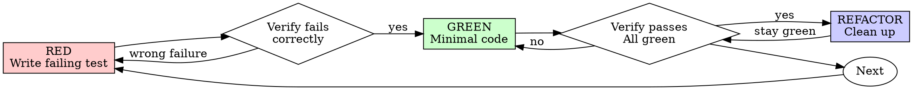

# Test-Driven Development (TDD)

## Overview

Write the test first. Watch it fail. Write minimal code to pass.

**Core principle:** if you didn't watch the test fail, you don't know if it tests the right thing.

**Violating the letter of the rules is violating the spirit of the rules.**

> **NovaCore adaptations (vendored from Superpowers v6.2.0):**
> - Python is the default stack — `pytest` is the test runner. For Pine Script, route work through `pinescript-developer` (no runtime test framework exists for Pine; its review loop is the closest equivalent).
> - The Iron Law is preserved. Exceptions still require explicit operator approval — NovaCore's path-choice autonomy does not waive the Iron Law; it only waives asking permission for *execution* choices within an approved task.
> - Upstream phrasing "your human partner" is rendered here as "operator".

## When to Use

**Always:**
- New features
- Bug fixes
- Refactoring
- Behavior changes

**Exceptions (ask the operator):**
- Throwaway prototypes
- Generated code
- Configuration files

Thinking "skip TDD just this once"? Stop. That's rationalization.

## The Iron Law

```
NO PRODUCTION CODE WITHOUT A FAILING TEST FIRST
```

Wrote code before the test? Delete it. Start over.

**No exceptions:**
- Don't keep it as "reference"
- Don't "adapt" it while writing tests
- Don't look at it
- Delete means delete

Implement fresh from tests. Period.

## Red-Green-Refactor



### RED — Write Failing Test

Write one minimal test showing what should happen.

Good:
```python
def test_retries_failed_operations_three_times():
    attempts = {"count": 0}

    def operation():
        attempts["count"] += 1
        if attempts["count"] < 3:
            raise RuntimeError("fail")
        return "success"

    result = retry_operation(operation)

    assert result == "success"
    assert attempts["count"] == 3
```
Clear name, tests real behavior, one thing.

Bad:
```python
def test_retry_works():
    mock = Mock(side_effect=[Error(), Error(), "success"])
    retry_operation(mock)
    assert mock.call_count == 3
```
Vague name, tests mock not code.

**Requirements:**
- One behavior
- Clear name
- Real code (no mocks unless unavoidable)

### Verify RED — Watch It Fail

**Mandatory. Never skip.**

```bash
pytest path/to/test.py::test_name -v
```

Confirm:
- Test fails (not errors)
- Failure message is expected
- Fails because feature is missing (not typos)

**Test passes?** You're testing existing behavior. Fix the test.

**Test errors?** Fix the error and re-run until it fails correctly.

### GREEN — Minimal Code

Write the simplest code that passes.

Good:
```python
def retry_operation(fn):
    last = None
    for i in range(3):
        try:
            return fn()
        except Exception as e:
            last = e
    raise last
```
Just enough to pass.

Bad:
```python
def retry_operation(fn, max_retries=3, backoff="linear", on_retry=None):
    ...  # YAGNI
```
Over-engineered.

Don't add features, refactor other code, or "improve" beyond the test.

### Verify GREEN — Watch It Pass

**Mandatory.**

```bash
pytest path/to/test.py::test_name -v
```

Confirm:
- Test passes
- Other tests still pass
- Output pristine (no errors, warnings)

**Test fails?** Fix the code, not the test.

**Other tests fail?** Fix now.

### REFACTOR — Clean Up

After green only:
- Remove duplication
- Improve names
- Extract helpers

Keep tests green. Don't add behavior.

### Repeat

Next failing test for the next feature.

## Good Tests

| Quality | Good | Bad |
|---------|------|-----|
| **Minimal** | One thing. "and" in the name? Split it. | `test_validates_email_and_domain_and_whitespace` |
| **Clear** | Name describes behavior | `test_test1` |
| **Shows intent** | Demonstrates desired API | Obscures what code should do |

> **Note (NovaCore):** upstream v6.2.0 references `writing-good-tests.md` (a positive test-quality catalog with six rules, falsifiability discipline, and hard stops for string-presence and change-detector traps). That skill is not vendored in NovaCore. Consult upstream at `obra/superpowers/skills/writing-good-tests/SKILL.md` when needed.

## Common Rationalizations

| Excuse | Reality |
|--------|---------|
| "Too simple to test" | Simple code breaks. Test takes 30 seconds. |
| "I'll test after" | Tests passing immediately prove nothing. |
| "Tests after achieve same goals" | Tests-after = "what does this do?" Tests-first = "what should this do?" |
| "Already manually tested" | Ad-hoc ≠ systematic. No record, can't re-run. |
| "Deleting X hours is wasteful" | Sunk cost fallacy. Unverified code is tech debt. |
| "Keep as reference, write tests first" | You'll adapt it. That's testing after. Delete means delete. |
| "Need to explore first" | Fine. Throw away exploration, start with TDD. |
| "Test hard = design unclear" | Listen to the test. Hard to test = hard to use. |
| "TDD will slow me down" | TDD faster than debugging. |
| "Existing code has no tests" | You're improving it. Add tests for existing code. |

## Red Flags — STOP and Start Over

- Code before test
- Test after implementation
- Test passes immediately
- Can't explain why test failed
- Tests added "later"
- Rationalizing "just this once"
- "I already manually tested it"
- "Keep as reference" / "adapt existing code"
- "Already spent X hours, deleting is wasteful"

**All of these mean: delete code, start over with TDD.**

## Example: Bug Fix

**Bug:** Empty email accepted

**RED**
```python
def test_rejects_empty_email():
    result = submit_form({"email": ""})
    assert result["error"] == "Email required"
```

**Verify RED**
```bash
$ pytest tests/test_form.py::test_rejects_empty_email -v
FAIL: AssertionError: assert None == "Email required"
```

**GREEN**
```python
def submit_form(data):
    if not data.get("email", "").strip():
        return {"error": "Email required"}
    # ...
```

**Verify GREEN**
```bash
$ pytest tests/test_form.py::test_rejects_empty_email -v
PASS
```

**REFACTOR**
Extract validation for multiple fields if needed.

## Verification Checklist

Before marking work complete:

- [ ] Every new function/method has a test
- [ ] Watched each test fail before implementing
- [ ] Each test failed for expected reason (feature missing, not typo)
- [ ] Wrote minimal code to pass each test
- [ ] All tests pass
- [ ] Output pristine (no errors, warnings)
- [ ] Tests use real code (mocks only if unavoidable)
- [ ] Edge cases and errors covered

Can't check all boxes? TDD was skipped. Start over.

## When Stuck

| Problem | Solution |
|---------|----------|
| Don't know how to test | Write wished-for API. Write assertion first. Ask the operator. |
| Test too complicated | Design too complicated. Simplify interface. |
| Must mock everything | Code too coupled. Use dependency injection. |
| Test setup huge | Extract helpers. Still complex? Simplify design. |

## Debugging Integration

Bug found? Write a failing test that reproduces it. Follow the TDD cycle. The test proves the fix and prevents regression. Never fix bugs without a test.

## Final Rule

```
Production code → test exists and failed first
Otherwise → not TDD
```

No exceptions without operator permission.
